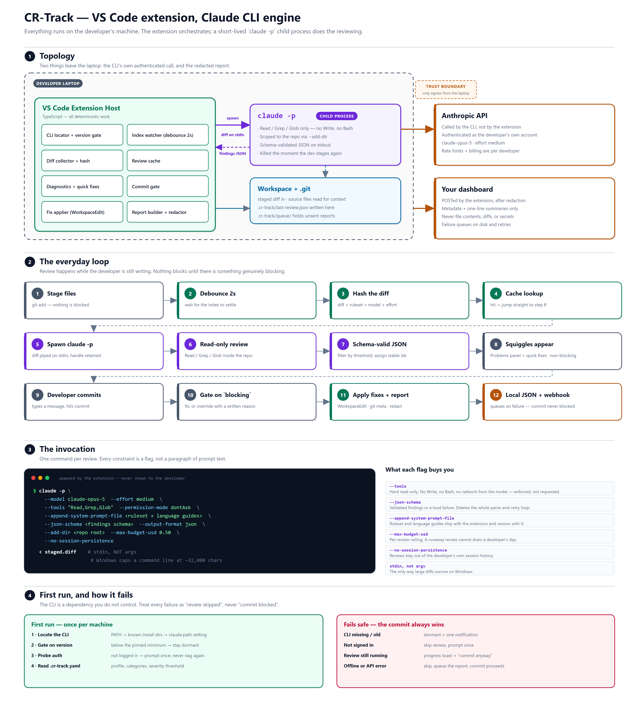

# CR-Track — Solution Architecture

VS Code extension that reviews a developer's changes with Claude before they
commit, and reports the outcome to a dashboard.



## Guiding principle

> **The model judges code. Everything else is code.**

A prototype version of this asked the LLM to run git commands, assemble a
12-field JSON envelope, apply redaction regexes, POST a webhook, and
self-correct on HTTP 422. That is deterministic work being done
non-deterministically — slow, token-expensive, and it manufactures a consent
decision that then has to be argued away in the prompt.

Moving it into TypeScript removes the token cost, the retry loop, and the
argument.

## Shape

Everything runs on the developer's machine. The extension orchestrates; a
short-lived `claude -p` child process does the reviewing. Two things leave the
laptop: the CLI's own authenticated call to Anthropic (billed to that
developer), and the redacted report to the dashboard.

| Component | Responsibility |
|---|---|
| CLI locator | PATH → known install dirs → `crTrack.claudePath`; version gate |
| Index watcher | Detect a staged-set change, debounce 2s |
| Diff collector | Scoped diff (`staged` / `all` / `committed`), stats, cache key |
| Review cache | `workspaceState`, keyed by diff hash |
| Review runner | Spawn the CLI, feed the diff on stdin, parse the result |
| Diagnostics provider | Findings → squiggles + quick fixes |
| Commit gate | SCM button; blocks only on `blocking` severity |
| Fix applier | `WorkspaceEdit`, approved findings only |
| Report builder + redactor | git metadata, diffstats, outcomes; strip secrets |
| Telemetry client | Local JSON + webhook POST with a disk-backed retry queue |

## Key decisions

| # | Decision | Why |
|---|---|---|
| D1 | **Local Claude CLI as the engine** | Every developer is already authenticated. No API key to distribute, no backend to host, no per-key rotation problem. Usage bills to each developer's own account. |
| D2 | **Review on stage, not on commit** | A blocking 40s review teaches the team `--no-verify` within a week. Speculative review is finished before the button is pressed. |
| D3 | **`--json-schema` for output** | Validated findings or a loud failure. Deletes the parse-repair loop entirely. |
| D4 | **`--tools "Read,Grep,Glob"`** | Read-only is enforced by the harness, not requested in a prompt. No Write, no Bash, no network. |
| D5 | **Diff on stdin, prompt via `--append-system-prompt-file`** | Windows caps a command line near 32,000 chars. Both would exceed it as argv. |
| D6 | **`claude-opus-5`, effort `medium`** | Strong at medium effort and this is a latency path. Sweep against a real eval set before locking it in. Thinking is on by default and counts against `max_tokens`. |
| D7 | **Byte-stable prompt prefix** | Ruleset and guides assembled in fixed order with nothing per-run interpolated, so prompt caching works. |
| D8 | **Diagnostics, not chat** | Native approval surface; replaces an `f1 f3` text grammar. |
| D9 | **Every failure means "review skipped"** | The CLI is a dependency we do not control. It must never block a commit. |

## Model I/O contract

**In:** unified diff on stdin; ruleset + matched language guides as the system
prompt; read-only repo access for context.

**Out:** one schema-validated object — `findings[]` with `file`, `lineStart`,
`lineEnd`, `severity`, `category`, `title`, `description`, `suggestion`,
`confidence`, plus optional report-only `annotations[]`.

No `id`, no `status`, no `accepted`, no envelope. The engine assigns ids
deterministically after filtering (severity → path → line → category) so the
same change set always produces the same numbering.

## Cache key

```
sha256(diff + model + effort + profile + categories + minSeverity + guides)
```

Anything that changes the answer is in it. A timestamp, review id, or branch
name must never be — that would make every key unique and the cache useless.

## Delivery phases

| Phase | Scope | Status |
|---|---|---|
| 0 | Review engine, standalone — see [`../engine/`](../engine/) | **Done** |
| 0.5 | Tune finding quality against real commits | Next |
| 1 | Extension shell — activation, config, watcher, process lifecycle | |
| 2 | UI — diagnostics, quick fixes, commit gate | |
| 3 | Reporting — report builder, redactor, webhook, retry queue | |
| 4 | Hardening — cross-platform, packaging, real-machine testing | |

Estimate for 1–4 is roughly 5–8 weeks for one developer. Phase 0.5 is the real
risk and the one that cannot be sized in advance: if findings are noisy,
developers stop reading them and the rest of the work is wasted.

## Risks

| Risk | Mitigation |
|---|---|
| Findings are noisy | Phase 0.5 is a gate, not a formality. Ship with a high `minSeverity` and loosen it later. |
| CLI missing or version-skewed | Locator with fallback paths + a pinned minimum version; dormant rather than broken. Note `~/.local/bin` is a real install location that is often **not** on PATH. |
| Latency on large diffs | Split per file, cap concurrent CLI processes at 2–3. |
| `--no-verify` bypass | Accepted. This design is advisory by nature; if enforcement is required later, add a PR-time check. |
| Finding counts used as a developer metric | Counts are non-deterministic. Report categories, coverage, and accept/dismiss trends — not individual rankings. |
